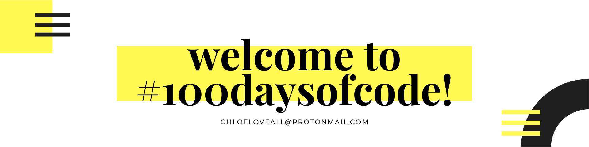

🟡 &nbsp; I started a **#100DaysofCode Challenge** inspired by <a href='https://github.com/kallaway'>Alex Kallaway</a>.

🟡 &nbsp; Started 06/01/2021

🟡 &nbsp; I plan to build a mix of single day and multi-day projects. I love to learn new things and thought this would be a fun way to explore things that interest me! 

🟡 &nbsp;Check out my work so far!

#

<table>
  <tr>
    <td style='width: 200px;'> <h1>Day</h1> </td>
    <td> <h1 style='width: 200px;'>Date</h1> </td>
    <td> <h1 style='width: 250px;'>Live Site</h1> </td>
    <td> <h1 style='width: 250px;'>Repo</h1> </td>
  </tr>
  <tr>
    <td> <b> Day 001 </b> </td>
    <td> 06/01/2021 </td>
    <td> <a href='https://let-it-snow.vercel.app/'>Let It Snow</a> </td>
    <td> <a href='https://github.com/chloeloveall/let-it-snow'>Let It Snow GitHub Repo</a> </td>
  </tr>
  <tr>
    <td> <b> Day 002 </b> </td>
    <td> 06/02/2021 </td>
    <td> <a href='https://quotable-generator.vercel.app/'>Quotable Generator</a> </td>
     <td> <a href='https://github.com/chloeloveall/quotable-generator'>Quotable Generator GitHub Repo</a> </td>
  </tr>
  <tr>
    <td> <b> Day 003 </b> </td>
    <td> 06/03/2021 </td>
     <td> <a href='https://tipped-neon.vercel.app/'>Tipped</a> </td>
    <td> <a href='https://github.com/chloeloveall/tipped'>Tipped GitHub Repo</a> </td>
  </tr>
</table>